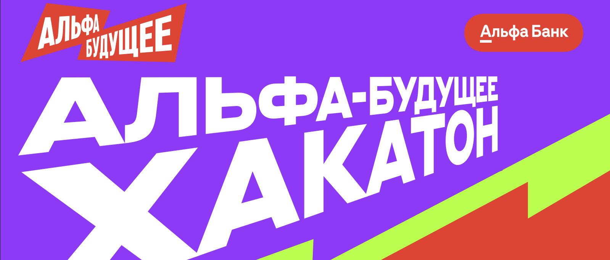
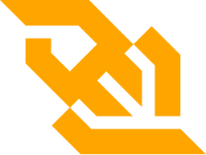

<div align="center">
  
# АЛЬФА БУДУЩЕЕ ХАКАТОН <br> Разработка copilot-приложения для клиентов микробизнеса



</div> 


## Оглавление
- ### [Кейс](#1)
- ### [Решение](#2)
- ### [Запуск кода](#3)
- ### [Уникальность нашего решения](#4)
- ### [Стек](#5)
- ### [Команда](#6)
- ### [Скринкаст](#7)

## <a name="1"> Кейс </a>

Разработайте приложение-помощник, которое поможет владельцам малого бизнеса эффективно решать повседневные задачи с использованием возможностей LLM (Language Learning Models). Приложение должно предоставлять рекомендации по ключевым аспектам бизнеса, таким как юридические вопросы, маркетинг, финансы и другие.

## <a name="2">Решение </a>

### Архетиктура решения

Решение представляет собой микро-сервисную архитектуру, включающую в себя:
- Backend - Golang + Fiber
- Frontend - TypeScript + React
- Ml - LangGraph + FastAPI
- Ollama
- Minio - S3
- Postgres
- AssemblyAI - Whisper
- Migrations

### Архетиктура модели

LangGraph-пайплайн `pipeline.py` ML-сервиса состоит из режимов `fast`, `thinking` и `research`. Узел `Mode Decider`
определяет режим и направляет состояние GraphState:
- **Fast**: цепочка `Flash Memories → Fast answer → Final answer` быстро генерирует ответ, если
  контекст достаточен.
- **Thinking**: `Thinking planner` строит пошаговый план, исполняет вспомогательные инструменты и
  агрегирует доказательства, после чего `Thinking answer` формирует итог.
- **Research**: цикл `Research reason → Research tool call ↔ Research observer → Research answer`
  позволяет агенту запрашивать зарегистрированные инструменты, валидировать аргументы и сохранять
  наблюдения, пока `NextAction` не укажет на готовность финализировать ответ.

GraphState хранит историю шагов, доказательства, промежуточные подсказки и активные наблюдения, что
делает пайплайн детерминированным и пригодным для отладки. Перед запуском графа сервис проверяет
валидность голосового ввода, определяет тег диалога (юридические вопросы, маркетинг и т.д.) и только
после этого запускает потоковое поколение ответа.

## <a name="3">Запуск кода </a>

### Последовательные шаги для запуска кода:
1. Склонируйте гит репозиторий;
```Bash
git clone https://github.com/FRIZFOREVER/alfa_copilot_2025.git
```
2. Прочитайте .env.example и по инструкциям в нём создайте и заполните .env в той же папке 

3. Запустите все контейнеры:
```shell
Docker compose up --build
```

4. Для доступа к сайту необходимо перейти по ссылке [http://localhost:5173/](http://localhost:5173/)


## <a name="4">Уникальность нашего решения </a>

### Киллерфичи:
1. Несколько режимов работы логики нашего решения со стороны ml, который адаптируется к не до конца заполненным данным и запросам пользователя
2. Backend на Golang полностью покрыт unit-тестами, все сервисы коммуницируют друг с другом только через него
3. Реализованы интеграции с интернет-поиском через агента и отправкой сообщений в телеграм через Frontend
4. Решение разворачивается полностью локально, использует только Open-source источники и не требует внешнего платного API для функционирования
5. Агент отправляет статус своих размышлений по технологии Websocket и это отрисовывается на Frontend'е
6. Ответ на Frontend поступает по протоколу SEE, что позволяет генерировать ответ на глазах, не дожидаясь окончания его генерации 

## <a name="5">Стек </a>
<div align="center">
  
  
  
  
  
  
  
    
  
  
  
  
  
  
  
  
  
</div>

## <a name="6">Команда </a>

*Состав команды "Жабки МИСИС"*   

- <h4>: @facT0RR, Маслов Денис - Backend-developer</h3>
- <h4>: @FRIZFOREVER, Хромов Кирилл - ML-engineer / ML-Ops</h3>
- <h4>: @egoryaaa, Яровицын Егор - Frontend-developer</h3>
- <h4>: @Llaceyne, Гулария Лана - UI/UX Designer </h3>


## <a name="7">Скринкаст </a>

- [Cсылка на скринкаст](https://youtu.be/UypCoDZtJKo?si=_nhtPIP5xlJcuEwv)&nbsp;
